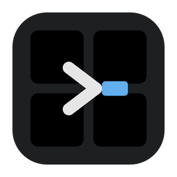
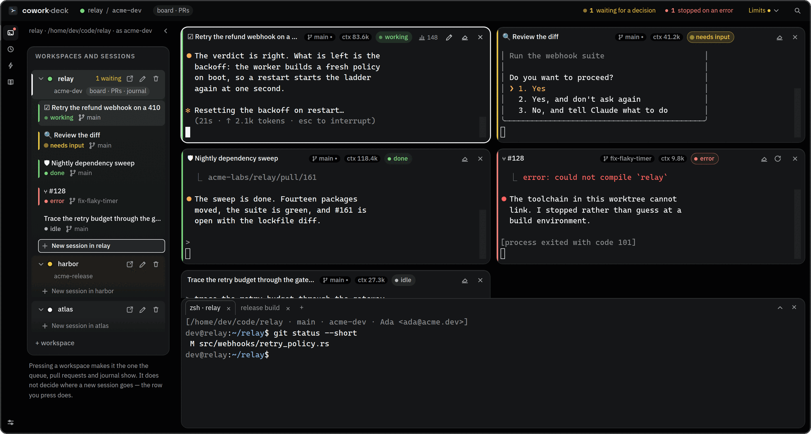
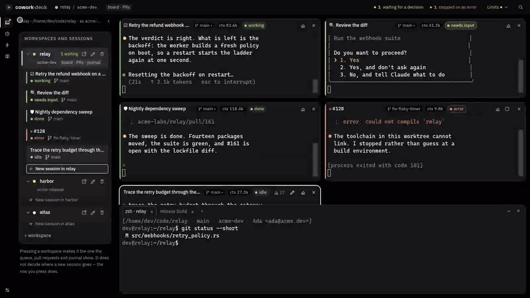
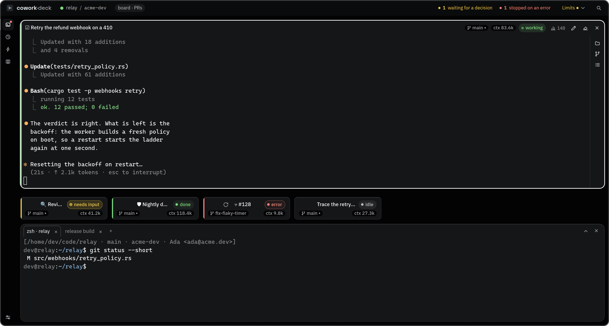
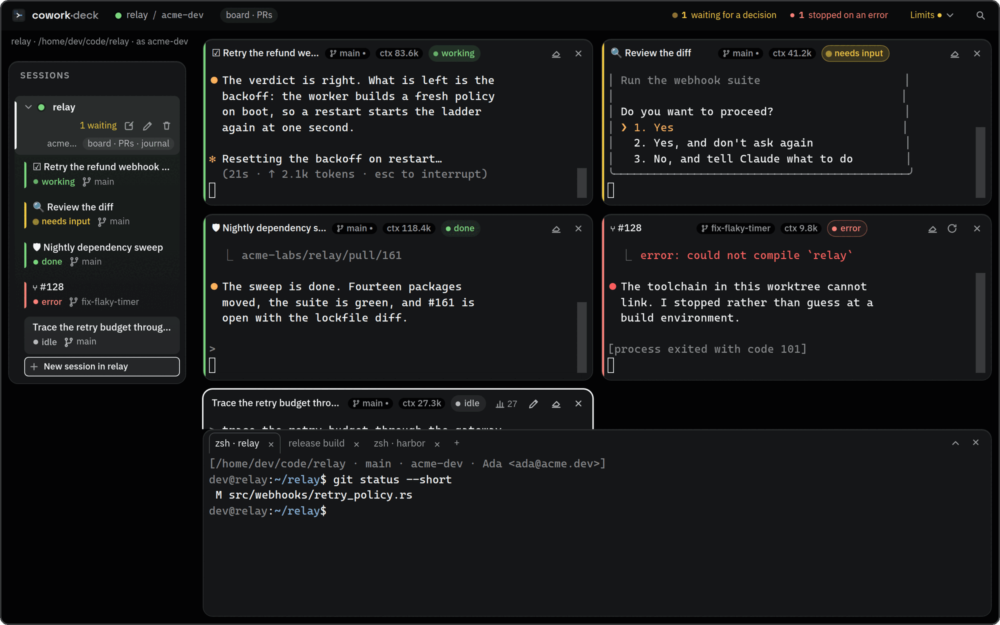
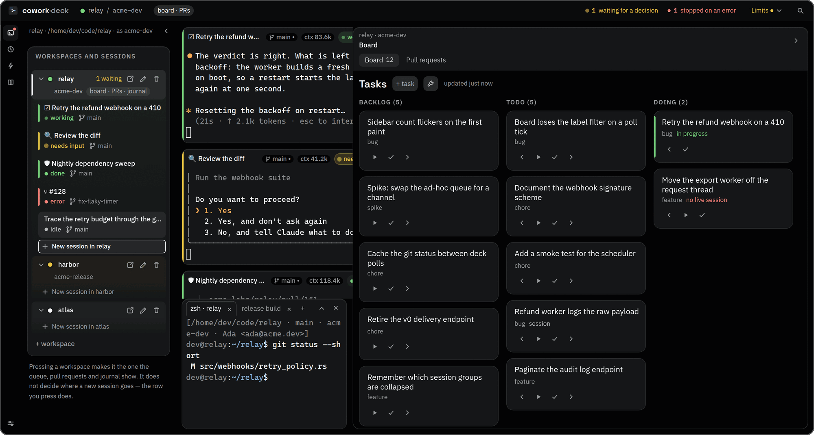
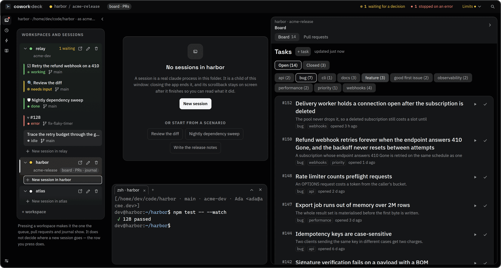
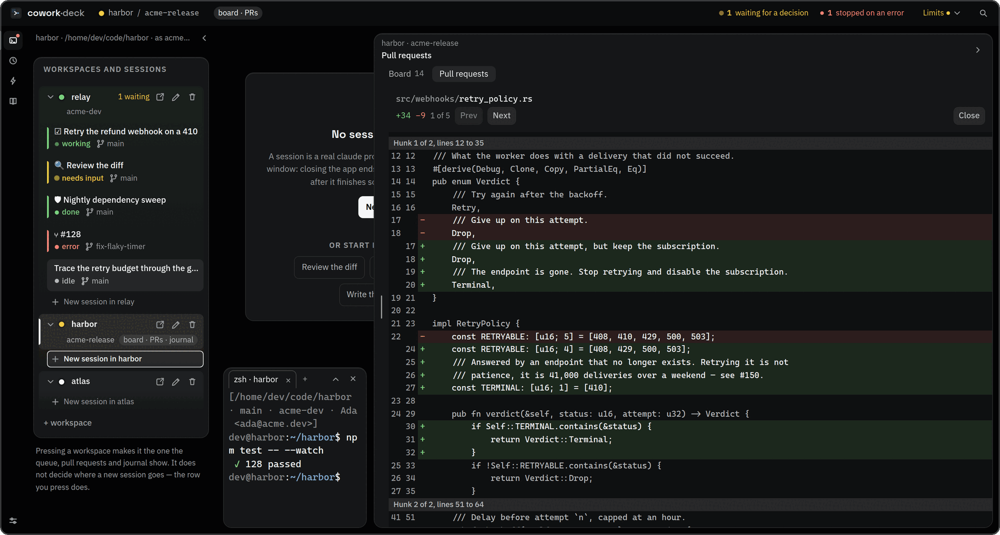

<div align="center">



# cowork-deck

**A desktop deck for running many [Claude Code](https://docs.claude.com/en/docs/claude-code) sessions at once.**

Every tile is a real terminal — a PTY-backed `claude` in a project folder you chose — and the window
answers one question at a glance: *which of these needs me?*


<br />



<sub>Five sessions, five states, one glance. The bar down the left edge of each tile is its state —
green working, amber waiting on you, red broken — so a dozen sessions read in one sweep instead of a
dozen labels. The two readings in the top bar count the only two things that want a person.</sub>

<br />
<br />



<sub>Half a minute of the real UI: a session finishes its turn, zoom and juggle, a workspace's board
reading its repository's issues, a pull request and its diff — and back to the deck, which never left.
Recorded against the screenshot harness, so everything on screen is invented fixture data.</sub>

</div>

---

Each tile is a real terminal attached to a `claude` process in a workspace folder, optionally launched
with a saved prompt. State — idle, working, finished a turn, waiting for a decision, ended, error —
comes from Claude Code's own hooks and shows up as a rail, a chip, and a desktop notification if you
want one.

Two things it does that a window full of terminals does not. Every workspace carries **its own GitHub
account**, so sessions in two projects push, open pull requests and sign commits as two different
people at the same time — without the app ever switching the account your own shell is on. And your
workspaces, their bindings, your scenarios and the run journal **follow you to the next machine**,
through a private repository that is yours rather than anybody's cloud.

Built with [Tauri v2](https://v2.tauri.app/) (Rust: PTY and process management) and a small
TypeScript + [xterm.js](https://xtermjs.org/) frontend, no UI framework. Around 100 MB resident.

## The window

One row, three parts, and nothing ever replaces the deck:

- **The rail** — three icons that decide what the panel beside it holds: the tree, the journal of every
  run, the scenarios. Settings sits at its foot, under a gap, because it changes nothing about the
  panel.
- **The panel** — workspaces and their sessions as **one tree**. A workspace appears once and its
  sessions are its children, so "which project is this session in" and "where will a new one go" have
  the same answer. Creation is positional: the last row inside each group reads *New session in
  `<name>`*, at the place the new session will appear.
- **The deck** — the tiles. It never leaves the row; when a page needs width it *yields* by falling
  into its filmstrip rather than disappearing.

The top bar carries the workspace you are on and the account a push from it goes out as, plus a
**ledger**: "1 waiting for a decision", "1 stopped on an error". Each reading opens one of the sessions
it counted. A run that finished while nobody watched is not in it — it wants nothing from you.

The board and the pull requests are **one repository's**, so they are not in the rail: they open from
that repository's own row, into a panel on the other side of the deck.



*Double-click a tile's header and it takes the window; the rest become a filmstrip. The cards carry no
terminal on purpose — at that size a terminal is texture, not information, so the space goes to the
four things worth knowing about a session you are not watching.*

## Sessions

- **State you can read across a dozen tiles.** "Finished a turn" and "waiting for a decision" are
  separate on purpose: an interactive `claude` parks at the prompt when it is done, which is not the
  same as being blocked on a permission request.
- **They name themselves.** A session started with no scenario and no card takes its name from Claude
  Code's transcript, so six rows reading `session · myproject` become six topics. The name says what
  the conversation *started* as; rename any tile with `F2` or the pencil, and emptying the field brings
  the automatic name back.
- **Nothing is torn down without asking.** Quitting names the sessions with something running in them
  and waits. What is killed is the whole process *session*, so a `npm run build` inside a shell dies
  with it rather than outliving the app.
- **Restart resumes the conversation** (`claude --resume`), and yesterday's tiles come back on launch.
- **Broadcast** types one thing into several sessions at once.
- **What a session actually did.** The token badge says what it cost; the chart button beside it, or a
  click on the badge, says what it ran — see below.

Sessions are children of the app: there is no detached mode, and the scheduler only fires while the
window is open. Missed runs are not lost — each scheduled scenario catches up once on the next launch.

### Activity: which tools a session ran

A tile's `ctx 83.7k` badge says what a session **costs**. The chart button next to it — and a click on
the badge itself — opens what it **did**: a count per tool, and three ways to read it.

- **By tool.** The name the CLI itself used, never a renamed one, with a quiet category chip beside it
  and a bar scaled to the busiest row. `Bash 334` and nothing else is a different session from twenty
  tools over a hundred calls, and the shape is visible before the digits are read.
- **By agent.** The main conversation, then a row per subagent reading `agent type — description`,
  indented by how deep it was delegated. This is the section the terminal cannot give you: a session
  whose work was mostly delegated looks idle in its own scrollback.
- **By MCP server.** Shown only when there were MCP calls. Half the distinct tool names in a measured
  project were MCP across just two servers, and without the grouping the list is a wall of one prefix.

Failures and refusals are counted **separately** and shown only when there are any. A refused call never
ran; a session that declined three commands is not a session that broke three times.

**The numbers come from the agent's own log, not from anything the deck records.** Two things follow,
and both are the point rather than a limitation:

- They cover the **whole conversation**, including the part that happened before this window was open.
  Restart a tile, resume it tomorrow, `/clear` in the middle — the counts follow the conversation.
- They are **only as fresh as the log**, exactly as the token badge already is.

The panel reads that log when you open it and while it stays open, and not otherwise — a deck of twelve
with no panel open reads nothing. The reasoning is in
[ADR-0008](docs/adr/0008-session-activity-is-read-from-the-agents-log-not-from-our-hooks.md).

Which CLIs can be read today: **Claude Code**, the **Copilot CLI**, and **opencode**. Every session the
deck launches is Claude Code — driving the others is a separate piece of work — but a log can be read
for a session the deck did not start. A CLI with no reader says so rather than showing zeroes.

## Limits: what each AI has left, and where that number came from

A dozen sessions draw on **one** budget, and when it runs out they stall together. A block at the foot
of the panel says what each connected AI has left — one row apiece, a thin meter, and when it lifts.

**The source of a number is part of the number**, and it is on the row beside it rather than in a
tooltip:

- **Reported** — the account's own accounting, the figure `/usage` draws. Obtained by asking `claude`
  itself, the way this app asks `gh` about GitHub: it costs nothing from your budget and no password
  passes through the app. Switch it off in Settings if you would rather nothing started a short-lived
  process every few minutes to ask.
- **Observed** — what the app can see for itself, from the sessions it runs. Real, and *narrower than
  your account*: other terminals, other machines and anything outside this app are not in it. The
  dialog says so in words, and no meter is drawn for it — the app knows what it spent, not what was
  allowed, and it will not divide by a ceiling it invented.
- **Unknown** — it says so, and offers the one command that would answer it, in a tile.

The reading that matters most needs no percentage at all. When a session is refused, the app reads the
limit banner on its way to the screen and the pill stops saying *3 waiting for input* — which is true
and useless — and says **nothing moves until 19:00**. That survives a restart, and you are told again
when it lifts.

## A GitHub account per workspace

Bind a workspace to a `gh` account and every session it starts has that access already in place:
`gh pr list`, `git push`, the board reading the repository's issues, the pull requests, and the
authorship of the commits — all of it goes out as the right person. Two workspaces run on two accounts
**at the same time**, which is the whole point: the app never calls `gh auth switch`, so sessions on
different accounts cannot spoil each other's environment and your own terminal outside the app keeps
whichever account was active there. With `GH_TOKEN` set, `gh` itself refuses to change account, so a
session cannot do it either.

**No tokens are stored.** The workspace's settings hold the account name and nothing else; the token is
read from `gh`'s keyring at the moment a session starts and handed to the child process through
environment variables (`GH_TOKEN`, `GIT_AUTHOR_*`, and `GIT_SSH_COMMAND` where it is needed).

Changing the binding applies to new and restarted sessions — a process's environment is fixed when it
starts — so a live session is marked `GitHub ⟳` rather than quietly running on the old one. If the
account could not be attached at all (no `gh`, logged out, a locked keyring) the session still starts,
with an empty `GH_CONFIG_DIR` so that `gh` says "not logged in" honestly instead of quietly working as
somebody else; the tile carries `GitHub ✕` and the reason.

You need the [GitHub CLI](https://cli.github.com/) logged in to the accounts you mean to use. The
GitHub screen in the command palette shows what `gh` reports and helps install it if it is missing —
the install command filled in for your platform, in an **editable** field, running in an ordinary
terminal tile so you see its output and type your own `sudo` password.

## Workspaces

A workspace is a project folder, a colour, and the account above.

**A shell drawer per workspace.** `Cmd+J` (`Ctrl+Shift+J` elsewhere) opens ordinary interactive shells
under the deck, started in the workspace's folder and carrying its account — and saying so in one line
before the first prompt, naming the folder, the branch, the account and the git identity it will commit
as. That line is the only way to check the identity: the binding is injected as `GIT_AUTHOR_*`, which
outranks `.git/config`.

The drawer can also take the deck's place for a moment: the chevron in its bar — or `Cmd+Shift+E`
(`Ctrl+Shift+E` elsewhere) — gives the terminals the whole column and gives it back, at the exact
height you had. It is deliberately momentary: switching workspace or putting the drawer away drops it,
and nothing about it survives a restart. The counts in the topbar stay visible while it is up, so a
session that starts waiting for you behind it still says so.

**A workspace can have a window of its own.** Pull one out — a button on its row, or drag it out on
macOS — and it gets a window holding that workspace and nothing else: no rail, no other projects, no
app-wide settings to confuse for the project's. In the main window it stays where it was, marked as
elsewhere, with its sessions still listed; clicking either raises the window that has them.



## Work: cards, issues, pull requests

**A board per workspace**, from one of two sources — never both.

*Markdown cards* in `.cowork/tasks/` (or any folder you point at — a dedicated repo, an Obsidian
vault). The steps and card kinds live in a `board.json` beside them, so one project runs
`backlog / todo / doing / shipped` and the next just `open / done`. `Cmd/Ctrl+Shift+T` files a card
without leaving the deck, ▶ launches a session with the card as its prompt, and sessions file their own
cards through a bundled `cowork_task` CLI — a side finding becomes a ticket instead of scope creep.
"In progress" is derived from live sessions, never stored, so nothing gets stuck there.



*Or the repository's own GitHub issues*, read under the workspace's account. ▶ opens a session on a new
branch in a worktree of its own; ✓ closes the issue, after asking. Issues open as documents — the body
rendered, the labels and the link to GitHub beside it.



**Pull requests** list under the same account: the checks, the review verdict, and how long ago each
moved. Four check states are distinguished and "no checks" is never shown as success. ▶ opens a session
on the pull request's branch in a worktree beside the workspace, never inside it. Merge is pinned to
the commit that was on screen — if the branch moved since the last refresh, the merge is refused and
you are asked to look again.



*Colour is the third channel in the diff, never the channel: the two bands measure ~1.0 against each
other, so the literal `+` and `−` in their own column do the work.*

## Scenarios, schedules, and the journal

A **scenario** is a saved prompt under a name, launched as a session in one press — pinned to one
workspace or offered in all of them. Each distinct `{{name}}` in the prompt becomes a field in a small
form at launch; a prompt with no placeholders asks nothing. Placeholder names are matched by letter
rather than by ASCII, so a prompt written in any script names its fields in that script.

Attach a **schedule** (hourly, daily at `HH:MM`, weekly) and it fires unattended into a fresh session
using stored defaults. It runs on *your* machine through *your* Claude Code — no cloud agents, no extra
cost, full local context and permissions. A scenario whose previous run is still working or waiting
skips rather than stacking a second one.

Every run is **journalled**: how it started, how long it took, the final message. The journal lists them
newest first, filterable by scenario and by trigger, and a row that produced nothing says *which*
nothing it was. Records are immutable; erasing exists at one granularity — one scenario's history,
wholesale. Recording can be switched off, and the screen says so rather than looking empty.

## Session notes

A session that closes can leave a **note** behind: what it did, what was decided,
what broke and why. That corpus is what later sessions — and, once the search lands, the
agents themselves — read instead of starting blind. It fills itself, so nothing depends on
anybody remembering to write anything down.

**It is asked, every first time, and it costs you money.** The session's transcript is sent
to a model to be summarised, and the call runs on **your own Claude account** — it spends
from your plan or your API budget. The question at the close says so before the button that
agrees to it, and you can answer once for good. Three positions, under **Session notes…** in
the command palette: ask each time, always write one, never write one.

What keeps the bill small is not restraint on your part. The transcript is reduced to its
prose before anything is sent — tool calls, their output, thinking and injected context are
most of the bytes of a working session and none of its meaning — what survives is capped, and
a session with nothing in it never reaches a model at all. The summary runs on the cheap
model, because shortening prose that is already in the request does not need the strong one.
Each capture prints what it cost.

**Notes are markdown on your disk**, under the same directory as your workspaces:

```
<config dir>/{workspace}/Sessions/2026-08/31-the-thing-you-fixed.md
<config dir>/{workspace}/Facts.md          durable claims, appended and never rewritten
<config dir>/Diaries/{room}/2026-08.md     lessons, global rather than per project
```

A **diary room** is where a lesson worth carrying to another project is filed — the model
picks the room from a sentence you write. Rooms are global on purpose: that is what lets a
mistake made in one repository stop the same mistake in the next. A room you remove keeps
every lesson already in it; what stops is new ones being filed there. Two rooms come
configured and both are yours to rewrite.

**A note is written by a model and may be wrong.** It is somebody's notes, indexed — not a
record of truth. Facts are appended and marked superseded rather than edited, so a wrong one
can be corrected without losing what it said.

**Writing into it yourself.** The memory page writes a note by hand, records a fact,
replaces one that has stopped being true, and files a lesson into a room you pick rather
than one a model picks. A note is written and edited where it is read — its raw markdown,
because that is what a note is on disk — and it keeps its `## TL;DR`: that is what a search
reads first, so a note without one does not come back from one. Saving is atomic, and a
capture never overwrites what you are writing.

**Editing a note makes a sync conflict likelier, and that is accepted rather than solved.**
Two machines editing one note stops the sync cycle and names the file: notes are prose, and
an automatic merge produces a plausible paragraph nobody wrote. A fact is
one line — the date and the `[active]` marker are written for you — and replacing one marks
the old line and puts the new one under it, so the corpus can still answer when it changed
and to what. A single short line is on disk and listed immediately, but is not searchable on
its own: the index skips anything under about 120 letters, so a file becomes findable once
it holds a few.

**Reading them.** The rail's **Memory** page lists everything ever written down — this
project's notes first, then the lessons, then every other project's. It is a directory
listing rather than a search, so it works on a machine that has downloaded nothing.
Choosing a note reads it where the deck was, and one control gives the deck back.

**Searching them.** The field at the top of that page — or **Search your notes…** in the
command palette, which lands on it — takes a sentence rather than a keyword: the notes are
indexed by meaning, so "why did the cross build pick the wrong architecture" finds the
session that answered it. A result opens the same way a listed note does.
Searching needs a 479 MB embedding model, downloaded once per machine and offered rather
than fetched behind your back — it runs on your machine and the index never leaves it.
Everything is on your disk; nothing about a search reaches a network.

**Your sessions can search them too.** A launched session is given a `search_memory` tool
of its own and told when to reach for it: before changing code in an area it has not seen,
and before settling a question somebody here has already settled. It reads; it never writes.
A session sees its own project's notes and every project's lessons, and nothing of anybody
else's project.

One limit worth knowing today: sessions on Claude Code get notes, and Copilot, opencode and
Codex ones do not yet — the deck says so rather than quietly skipping them. Since the deck
only launches Claude Code so far, that matters when you point it at a log rather than when
you start a session.

## The same setup on your other machine

Workspaces, their GitHub bindings, scenarios and the journal of what has run can live in a private
GitHub repository of your own, so a second machine has them without anyone copying files by hand. Off
until you switch it on, from **Memory sync…** in the command palette; switching it on needs `gh` and a
connected account, and offers both halves of the job — create a private repository, or connect the one
you already have, which is what every machine after the first does.

**What travels:** workspaces and their bindings, scenarios, the run journal (one file per machine, so
two never collide), and the memory corpus — session notes, project
facts, and the diary rooms with the lessons in them, so a mistake caught on one machine is
there on the other. **What does not:** session layout, window state, terminal drawers —
the repository is an allowlist, and a test asserts the tracked set equals it exactly. Absolute paths never travel: a workspace arriving from another machine has no folder here until
you point it at one, and a schedule arrives switched off so a 03:00 job does not start firing on two
machines. Conflicts are not resolved for you — notes are prose, and an automatic merge produces a
plausible paragraph nobody wrote.

**When both machines already had the project:** each added the folder before sync was switched on, so
each made its own id, and the arriving record looks like a second project. The deck recognises them by
the folder's git remote — the one thing that is the same string on both machines — and asks whether
they are the same project instead of deciding. The remote does not have to be called `origin`: the deck
takes `origin`, then `upstream`, then the only remote there is. Answering "same project" leaves one
workspace with this machine's folder and both machines' history; answering "different projects" leaves
both and does not ask again, on either machine.

A project kept without a git remote — a config folder, a scratch checkout — is recognised by the folder
instead, but only where both records are on *this* machine and point at the same directory. That
comparison never leaves the machine, and the only thing that travels is the answer. Two records with
neither a remote nor a folder here are compared to nothing, because a guess that is wrong merges two
real projects.

See [ADR-0006](docs/adr/0006-the-config-directory-is-the-sync-repository.md) for why the config
directory *is* the repository, and
[ADR-0007](docs/adr/0007-a-workspaces-identity-across-machines-is-its-remote.md) for what a workspace's
identity is across machines and what merging two records actually moves, as amended by
[ADR-0010](docs/adr/0010-where-there-is-no-remote-the-folder-is-the-identity.md).

## Install

Prebuilt bundles are on the [releases page](https://github.com/followLemmi/cowork-deck/releases): a
`.dmg` for macOS (Apple Silicon and Intel), an AppImage, `.deb` and `.rpm` for Linux. There is no
published Windows build yet — Windows means building from source.

<details>
<summary><b>macOS says the app "is damaged"</b></summary>

<br />

It is not. That wording is Gatekeeper's, and what it means is that the app is not notarized — there is
no paid Apple Developer account behind this project, so macOS quarantines the download instead of
checking a signature. Clear the flag once:

```bash
xattr -cr /Applications/cowork-deck.app
```

System Settings → Privacy & Security → "Open Anyway" is the same decision through the UI. And if you
would rather not clear a flag Apple set on a stranger's binary — fair — everything in the bundle is in
this repository, and `npm run tauri build` produces the same app from source.

</details>

## Build and run

**Prerequisites:** [Node.js](https://nodejs.org/) + npm, a [Rust toolchain](https://rustup.rs/), the
[Tauri v2 system dependencies](https://v2.tauri.app/start/prerequisites/), and Claude Code itself.

```bash
npm install
npm run tauri dev      # hot reload
npm run tauri build    # a release bundle for this platform
```

```bash
npm test                                            # frontend (vitest)
npm run contrast                                    # every colour pair the design claims
cargo test --manifest-path src-tauri/Cargo.toml     # backend (Rust)
```

> In a fresh clone or worktree, run `npm install && npm run build && npm run stage:reporter` once
> before `cargo test`: neither `dist/` nor `src-tauri/binaries/` is in git, and Tauri's build script
> fails without them.

**Two environment variables**, both optional: `COWORK_CLAUDE_PATH` pins a `claude` that is not on
`PATH` (without it, and with none found, the app says so on startup), and `COWORK_GH_PATH` does the
same for `gh`.

**The memory sidecar** is a separate crate under `crates/cowork-memory`, built and tested on its own
(`npm run stage:memory`). Its tests use a deterministic fake embedder; the ones needing the real model
are `#[ignore]`d.

## The design

The interface is a design system of its own — **True Ink**: a near-black, faintly cool ground where
**hue belongs to state**, so green, amber and red mean working, waiting on you and broken, and are
never spent on decoration. The accent is light itself, elevation is lightness rather than shadow (on
this ground a cast shadow has nowhere to go), and the terminal deliberately does not follow the
palette — it is a window onto another program, and those six ANSI hues are Claude Code's.

Every colour pair it claims is measured by `npm run contrast`, which fails if one falls under its
threshold and documents the three that deliberately do. The reasoning, the tokens, the mockups and the
measurements are in [docs/design/true-ink](docs/design/true-ink/README.md).

## Graceful degradation

State tracking depends on Claude Code's hooks reporting back. On an older `claude`, or if a hook fails
to fire, the terminal is unaffected — you can type, scroll and work normally. The only symptom is a tile
whose state label stays on `idle`.

The limits block degrades the same way, and says which rung it is on. The reported figure is read out of
`claude`'s own output, so a version that words it differently costs the *percentage* and nothing else:
the block stays where it is, falls back to **Observed**, and labels itself. It never blanks, and it
never passes the app's own counting off as your account's. See
[ADR-0009](docs/adr/0009-the-source-of-a-usage-number-is-part-of-the-number.md).

## Roadmap

Work is tracked in [GitHub issues](https://github.com/followLemmi/cowork-deck/issues); the epics below
are the shape of it. Decisions worth outliving their issue are in [`docs/adr/`](docs/adr/).

### Being built next

| | |
|---|---|
| **Project memory** [#35](https://github.com/followLemmi/cowork-deck/issues/35) | **Working, and being finished.** A closing session writes its own note, you can search them by meaning from the palette, and a session gets a `search_memory` tool of its own — see [Session notes](#session-notes) above. What is left is the panel that shows what a capture cost and which jobs failed, and reading the other CLIs' logs so their sessions get notes too. Local throughout: the embedding model runs on your machine and the index never leaves it. |

### After that

| | |
|---|---|
| **Frame rate** [#261](https://github.com/followLemmi/cowork-deck/issues/261) | Dragging a grip or resizing the window gives up three quarters of the display's frame rate. Measured, with the work that follows from the measurements. |

### Later

| | |
|---|---|
| **Remote decks** [#273](https://github.com/followLemmi/cowork-deck/issues/273) | A desktop and a laptop are two decks with no way to see one from the other. A headless core, an ssh transport, and another machine's sessions in this window — scrollback replayed on attach, one notification on the machine its person is at. |
| **Sessions that spawn sessions** [#178](https://github.com/followLemmi/cowork-deck/issues/178) | Work across five repositories today means a person acting as the message bus between five tiles. A guarded spawn channel and a `cowork_session` sidecar, so one session can start a colleague. |
| **More agent CLIs** [#330](https://github.com/followLemmi/cowork-deck/issues/330) | Codex, Copilot and opencode read first — their session logs are the activity panel's second, third and fourth sources — then run. |
| **UI localization** | A language switch and translated strings. The interface is English-only today, deliberately and by written rule — which is a decision about the source, not about the person using it. |

## Where things are written down

Two places and no third: **GitHub issues** carry the work, and **[`docs/adr/`](docs/adr/)** carries the
decisions worth outliving the issue that prompted them. `CLAUDE.md` at the root is the contract for
anyone — human or agent — sending a change: English everywhere that outlives a conversation, `dev` as
the trunk, `main` as the released state.

The screenshots above come from [`harness/`](docs/images/README.md), which is the app itself with the
backend replaced by fixtures: real xterm instances holding real bytes, invented accounts and
repositories. A re-shoot is a re-shoot, and nobody's paths are published.
