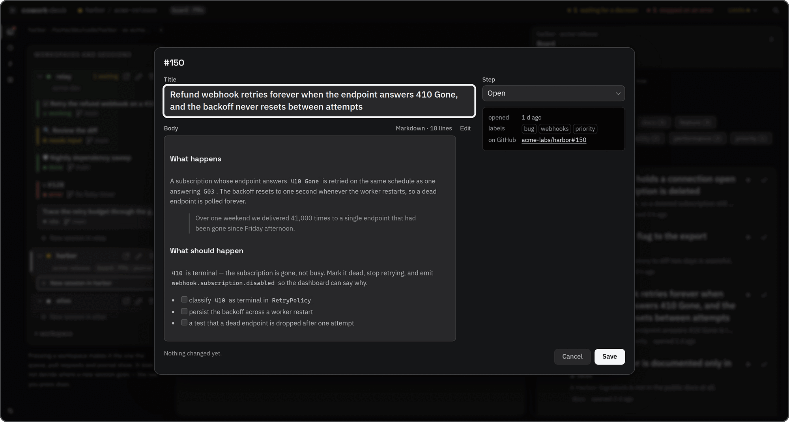

<div align="center">


# cowork-deck

**A desktop deck for running multiple [Claude Code](https://docs.claude.com/en/docs/claude-code) sessions side by side.**

Each tile is a real terminal — a PTY-backed `claude` process in a workspace of your choice — with live
per-session state, token usage, and git context at a glance.


<br />


<sub>Four sessions, four states, one glance. The bar down the left edge of each tile is its
state — green working, amber waiting on you, red broken — so twelve sessions read in one
sweep instead of twelve labels.</sub>

<br />
<br />


<sub>Twenty-five seconds of the real UI: a session finishes its turn, zoom and juggle, the
board reading a repository's issues, a pull request and its diff. Recorded against the
screenshot harness, so everything on screen is invented fixture data.</sub>

</div>

---

Each tile is a real terminal (backed by a PTY) attached to a `claude` process running in a chosen
workspace directory, optionally launched with a canned skill prompt. Session state (idle, working,
waiting for input, ended, error) is tracked per tile via Claude Code's hooks and surfaced as a label
and, optionally, a desktop notification.

Built with [Tauri v2](https://v2.tauri.app/) (Rust backend, PTY + process management) and a small
TypeScript / [xterm.js](https://xtermjs.org/) frontend — no UI framework. Memory footprint kept under
~100 MB.

The interface is a design system of its own — "Slate & Ember": a warm graphite dark theme where
**hue belongs to state**, so green, amber and red mean working, waiting on you and broken and are
never spent on decoration. Every colour pair it claims is measured by `npm run contrast`, which
fails if one falls under its threshold and documents the three that deliberately do. The reasoning,
the tokens and the measurements are in [docs/design/slate-ember](docs/design/slate-ember/README.md).

## Features

- **Multi-session deck** — run many `claude` sessions as tiles in one window, each a full interactive terminal.
- **Live state tracking** — per-tile `idle` / `working` / `finished a turn` / `waiting for a decision` / `ended` / `error`, driven by Claude Code hooks, with optional desktop notifications. Click a notification to focus that session. "Finished a turn" and "waiting for a decision" are separate on purpose: an interactive `claude` parks at the prompt when it is done, which is not the same as being blocked on a permission request.
- **Sessions that name themselves, and can be renamed** — a tile launched without a scenario or a card takes its name from Claude Code's own transcript, so six rows reading `session · myproject` become six topics. The name says what the conversation **started** as: Claude Code mints a title once and does not revise it, so a session that has moved on keeps its opening topic until you rename it. A title comes back in whatever language you prompted in, and nothing uppercases or transliterates it. Rename any tile with the pencil in its header, bare `F2`, or `Rename active session` in the palette; empty the field and the automatic name comes back. A name you type wins over everything and survives a restart, and a session launched from a card or a scenario keeps the name that says which one it belongs to.
- **Floating status pill** — an always-on-top pill counting the sessions blocked on a decision, so you can step away from the app and still know when one needs you. A session that merely finished its task announces itself with a notification instead.<br />
- **A GitHub account per workspace** — bind a workspace to a `gh` account and its sessions start with that access already in place: `gh pr list`, `git push` and the authorship of commits all go out as the right person. Different workspaces run on different accounts **at the same time** — the app never switches the active `gh` account and never touches `~/.config/gh`.
- **Workspaces** — group sessions by workspace in a color-coded sidebar, and switch the deck to show only one workspace's terminals.
- **Zoom / juggle** — double-click a tile header to expand one terminal near-full while the rest shrink to a filmstrip; click a shrunken tile to juggle focus (animated).
- **Scenarios** — a saved prompt under a name and a mark of its own, launched as a session in one press. A scenario is either pinned to one workspace or offered in every one of them, and an empty deck offers them as well, a canned prompt being the fastest start there is. The prompt can be parameterized: each distinct `{{name}}` in it becomes a field in a small "Launch parameters" form at launch, and a prompt with no placeholders asks nothing at all. A placeholder name is matched by letter rather than by ASCII, so a prompt written in any script names its fields in that script — the interface being English does not oblige anyone to think in it.
- **Scheduled scenarios** — attach a schedule (hourly / daily at `HH:MM` / weekly) to a scenario and it fires unattended into a fresh session, using stored defaults for its placeholders. It runs on *your* machine through *your* Claude Code — no cloud agents, no extra cost, full local context and permissions.
- **Run a schedule now** — a scheduled scenario carries a run-now button, a clock face with a play triangle where the hands would be, and it fires the scenario immediately and exactly as the schedule would. Not a skip-forward glyph, on purpose: the run it starts does not consume the upcoming scheduled one.
- **Scenario run history** — a scenario used to leave nothing behind: the entry vanished when its tile closed, so a schedule that fired at 03:00 into a session you never saw was unrecoverable by morning. Every run is now journalled — how it started, how long it took, and the final assistant message — and a History screen next to Terminals / Board / Pull requests lists them newest first, filterable by scenario and by trigger. A row that produced nothing says *which* nothing it was: still running, no session started, no transcript reported, or the transcript is gone. Three actions on a row and deliberately no fourth: go to the session while it is still live, re-run it through the usual "Launch parameters" form with the recorded values pre-filled and reconciled against the scenario as it stands now, and reveal the transcript in the file manager. History is immutable — no row can be edited or deleted; erasing exists at one granularity, a scenario's history wholesale, from the head of the screen while it is narrowed to that scenario. Recording can be switched off, and the screen says so rather than looking empty. Retention is the last 100 runs per scenario.
- **Task tracker** — a per-workspace backlog of markdown cards (`.cowork/tasks/` in the project, or any folder you point at — a dedicated repo, an Obsidian vault — where the cards go into a `cowork-deck-tasks/<workspace>/` folder the app creates, one container however many workspaces you point there). A Board screen next to Terminals, `Cmd/Ctrl+Shift+T` to file one without leaving the deck, and ▶ on a card launches a session with the card as its prompt. Sessions file their own tickets via a bundled `cowork_task` CLI, so a side finding becomes a card instead of scope creep. "In progress" is derived from live sessions, never stored, so nothing gets stuck.
- **Or the repository's issues** — a workspace's board can read the open and closed GitHub issues of the repository its folder is, instead of local card files, under the workspace's own account. ▶ on an issue opens a session on a new branch in a worktree of its own; ✓ closes the issue, after asking. One source per workspace, chosen in its settings, never both at once. See [The board's second source](#the-boards-second-source-github-issues).
- **A board each project configures** — the steps (columns) and card kinds live in a `board.json` beside the cards, so one project can run `backlog / todo / doing / shipped` and the next just `open / done`. Edit them from the board's ⚙ editor, which also moves the cards a rename or a removal would otherwise strand. Cards open as documents to read and edit, and move between steps by drag or by the ‹ › on the card. See [The board](#the-board).
- **An embedded terminal, per workspace** — a drawer under the deck holding ordinary interactive shells, so working on a repository does not mean alt-tabbing to a separate terminal. `Cmd+J` (`Ctrl+Shift+J` on Windows and Linux) opens it, and opening it empty opens a shell; tabs, `+`, double-click to rename, drag its top edge to resize. It is your own `$SHELL`, started in the active workspace's folder and carrying that workspace's GitHub account — and it says so in one line before the first prompt, naming the folder, the branch, the account and the git identity it will commit as. That line is the only way to check the identity: the binding is injected as `GIT_AUTHOR_*`, which outranks `.git/config`, so `git config user.email` inside the shell reports the value that loses. A terminal belongs to its workspace the way a tile does: switch projects and you get that project's terminals, on the tab you left it on — and a project you have never opened one in has no drawer at all, rather than an empty strip. Nothing is closed by switching: the shells keep running and their scrollback is where you left it. Tabs come back on the next launch, in the same folders, as new shells — a shell has no conversation to resume.
- **Nothing is torn down without asking** — closing a terminal that is running a job asks first, and so does quitting the app: it names the sessions with something running in them and waits. What it kills is the whole process *session*, not one process, so a `npm run build` left running in a shell dies with it rather than outliving the app.
- **Context-preserving restart** — restart an ended/errored tile and resume its Claude Code context (`claude --resume`).
- **Auto-restore** — reopen yesterday's tiles on launch; window size, position, and active workspace are persisted.
- **Broadcast input** — type once and send the same input to several sessions at once.
- **Observability** — token usage per session and per project, plus a git indicator on each tile.
- **Keyboard-first** — a command palette that lists every binding, `F6` to move between the sidebar and the terminal, and in-terminal search and clear. On Windows and Linux the bindings use `Ctrl+Shift`, leaving bare `Ctrl+W`/`Ctrl+B`/`Ctrl+K` to readline inside `claude`; macOS uses plain `Cmd`.
- **`Shift+Enter` writes a second line** — the legacy terminal encoding has no way to say "Enter, with Shift held", so a modified `Enter` would otherwise reach `claude` as a bare `CR` and submit the half-written message. The app sends `ESC`+`CR` instead — the same thing `claude`'s own `/terminal-setup` binds in iTerm2 and VS Code — for `Shift+Enter`, `Alt/Option+Enter` and `Ctrl+Enter` alike. Plain `Enter` still submits, and zoom keeps its binding (`Cmd+Enter` on macOS, `Ctrl+Shift+Enter` on Windows and Linux).

## Install

Prebuilt bundles are on the [releases page](https://github.com/followLemmi/cowork-deck/releases):
a `.dmg` for macOS (Apple Silicon and Intel) and an AppImage, `.deb` and `.rpm` for Linux. There is
no published Windows build yet — Windows today means building from source (see
[Build & run](#build--run)).

### macOS says the app "is damaged"

It is not. That wording is Gatekeeper's, and what it actually means is that the app is not
notarized — there is no paid Apple Developer account behind this project yet, so macOS quarantines
the download instead of checking a signature. Clear the quarantine flag once and it opens like
anything else:

```bash
xattr -cr /Applications/cowork-deck.app
```

System Settings → Privacy & Security → "Open Anyway" is the same decision made through the UI. And
if you would rather not clear a flag Apple set on a stranger's binary — fair — everything the
bundle contains is in this repository, and `npm run tauri build` produces the same app from source.

## Build & run

**Prerequisites:** [Node.js](https://nodejs.org/) + npm, a [Rust toolchain](https://rustup.rs/), and the
[Tauri v2 system dependencies](https://v2.tauri.app/start/prerequisites/) for your platform. Claude Code
(`claude`) must be installed (see [Locating the `claude` binary](#locating-the-claude-binary)).

```bash
npm install
npm run tauri dev      # dev mode with hot reload
npm run tauri build    # produces a release bundle for your platform
```

`npm run tauri dev` and `npm run tauri build` drive the Tauri CLI, which in turn runs `npm run dev` /
`npm run build` (Vite) for the frontend before launching or bundling the Rust app.

### Tests

```bash
npm test                                            # frontend (vitest)
cargo test --manifest-path src-tauri/Cargo.toml     # backend (Rust)
```

> In a fresh clone (or a fresh git worktree), run `npm install && npm run build &&
> npm run stage:reporter` once before `cargo test`. Neither `dist/` nor
> `src-tauri/binaries/` is in git, and Tauri's build script fails without them.

### Memory sidecar

`cowork_memory` is a separate crate under `crates/cowork-memory`. It builds and
tests independently of the app:

```bash
cargo test --manifest-path crates/cowork-memory/Cargo.toml
npm run stage:memory     # build + stage the sidecar binary
```

Its tests use a deterministic fake embedder and need no model; the tests that
need the real one are `#[ignore]`d. To exercise those, download it first
(479 MB) and point them at it:

```bash
cargo run --manifest-path crates/cowork-memory/Cargo.toml -- --root <dir> model --download
COWORK_MEMORY_MODEL_DIR=<dir>/.model cargo test --manifest-path crates/cowork-memory/Cargo.toml onnx -- --ignored
```

## Sessions and the app window

Sessions are not daemonized: every running `claude` process is a child of the app and is killed when the
app quits. There is no background/detached mode. If you
need a session to survive a restart, use the restart (⟳) affordance on a tile once it reaches `exited` or
`error` state — it starts a fresh session in the same workspace with the same initial prompt (resuming
Claude Code's context where possible), but it does not resume the app's own tracked state from before the
restart.

"Killed" means the whole process session, not the one process the app started: a shell puts each command
it is given into a process group of its own, so a `npm run build` is not reachable by signalling the
shell. Everything in the session is asked to stop, given a couple of seconds, and then killed outright.
The same teardown runs however the app ends — closing the window, `Cmd+Q`, or an update restarting it.

And it asks first. If anything is running inside a session when you quit — a build, a test run, a
command in the terminal drawer — the app refuses the first attempt and names what it is about to
destroy. Quitting again goes through regardless, so it can never become unquittable. A session sitting
at a prompt, and an agent's own long-lived helpers, are not counted: a question that is always there is
one people learn to click through.

The same applies to schedules: the scheduler lives inside the app, so a scheduled scenario only fires
while the window is open. Runs missed while the app was closed are not lost — each scheduled scenario
catches up once on the next launch, however long it has been. A scenario whose previous scheduled run is
still `working` or `needs input` skips the new run rather than stacking a second one. A run that simply
finished does not block the next one, and its tile is closed when the next run starts, so a scenario keeps
at most one tile.

A run that produced nothing — no workspace, a skipped overlap, `claude` missing — is recorded rather
than silently swallowed: the scenario's row says what happened and when it was last successful.


*Double-click a tile's header and it takes the window; the rest become a filmstrip. The
cards carry no terminal on purpose — at 232 × 132 a terminal is texture, not information,
so the space goes to the four things worth knowing about a session you are not watching.*

## The board

The Board is a screen of its own, not a panel: switching to it puts the columns
where the terminals were. A column per configured step, cards of one height, and
the terminal columns capped so a column nobody reads cannot grow without end —
a non-terminal column never hides a card, because hiding work is not the same as
tidying it.

Click a card to open it as a document: title, kind, step and body in one dialog,
and only the fields you actually changed are written back. Move a card by
dragging it into another column, or with the ‹ › on the card itself — those
arrows are the keyboard's equal, not a fallback, because a terminal tile eats
Tab. A card the app cannot safely write — damaged frontmatter, an id that
collides — refuses the move rather than offering it and failing. A card parked in
the working step with no session running on it is marked, since ▶ moves the card
itself and a crashed session would otherwise read as work in progress. Cards
naming a step the configuration does not know stay visible in their own column;
cards belonging to another project in a shared root are counted, not silently
hidden.


*The columns are the project's own — `board.json` beside the cards decides them. The card
is the raised surface and the column is not: what you can pick up sits above what you
cannot.*

### The configuration

Each project's tracker root (see [Task tracker](#features) above) holds a
`board.json` beside the cards. It lists the project's steps — a Kanban column
each — and its card kinds. Steps and kinds are **per project**: one board might
have `backlog / todo / doing / shipped`, another just `open / done`; nothing in
the app or its CLI assumes either. A step can carry two flags: `terminal`
(closed — more than one step may be terminal, and the first in configuration
order is where ✓ and `cowork_task done` send a card) and `working` (at most
one — where ▶ moves a card when it launches a session).

The ⚙ on the board edits all of it without leaving the app, and treats the cards
as part of the configuration rather than as its casualties: renaming a step
rewrites the cards standing in it, and removing a step that still has cards asks
where they should go instead of stranding them. It says how many cards a change
affects **before** you commit to it, and refuses a draft the backend would
reject anyway — so a broken board is caught in the form, not after the save.
Hand-editing the file still works; the backend validates independently either
way.

None of this applies to a board reading GitHub issues: its two columns are given
rather than configured, and ⚙ is not offered there. See
[The board's second source](#the-boards-second-source-github-issues).

If `board.json` is missing, the app creates it with today's default
`open`/`done` configuration. If it exists but cannot be parsed or fails
validation (no terminal step, a duplicate id, and so on), the board falls back
to that same default **without rewriting the file** — the broken bytes stay on
disk so you can fix your own typo, and the board shows a banner explaining
why.

### A session and its card

A running session gets its card's id via `COWORK_TASK_ID`, and its opening
prompt carries a snapshot of the steps as they stood at launch. That snapshot
ages the moment anyone edits the board, so the live list from
`cowork_task steps` is the authority when the two disagree. A session moves
its card with `cowork_task status <id> <step>`.

Keeping the card honest does not rest on the agent remembering to. ▶ writes the
working step itself, before the session starts, so the board is right whether or
not the agent cooperates. From there each turn is reminded of the card's current
step, and the first attempt to finish while the card is still open is refused
once, naming the call that would move it. Only once: a second attempt goes
through, because a reminder the session cannot get past is a trap, not a
reminder — and a card that genuinely belongs where it is stays there by saying
so. A tracker that cannot be read never blocks anything.

A session **not** launched from a card gets no such prompt, so the tracker
introduces itself instead: while the workspace has one configured, each turn
adds a line naming the card directory, the `cowork_task new` call that files a
card, and the kinds this board accepts. Without a configured tracker, or with a
`board.json` that cannot be read, it says nothing — there is nothing it could
say that would be true.

### Moving the cards

Point a workspace at a folder of your own and the form names the folders it
would create before it creates any of them, so a mistyped path is visible while
it is still free to fix. The cards land in
`<picked>/cowork-deck-tasks/<workspace>/`, which makes the workspace's own name
part of its root: renaming the workspace moves it. So whenever the root changes,
the app offers to bring the existing cards along, and until they are moved — or
the offer is dismissed — the board carries a banner for the ones still sitting at
the previous root. `board.json` travels with them, so a project does not lose its
columns by changing where its cards live.

### The board's second source: GitHub issues

A workspace's board reads either a folder of markdown cards or **the GitHub
issues of the repository its folder is** — one source, chosen in the workspace
settings (✎), never both at once. The GitHub source needs `gh` on the PATH, an
account bound to the workspace, and a folder that is **already a clone** of the
repository; each missing piece says so on the board and points at the fix. There
is no field for `owner/name` anywhere in the app: `gh` resolves the repository
from the folder, so a workspace pointing at anything that is not a clone cannot
be configured into a GitHub board.

The board is then two columns, `Open` and `Closed`, and they are **not
editable**: there is no `board.json` to edit, so ⚙ is not offered. Labels show as
chips; nothing on an issue maps to a card kind, so no kind chip is drawn. Closed
issues are fetched rather than accumulated, twenty at a time, so an issue you
close stays visible where you closed it.


*Each row carries a line of the issue's body, because a list of titles cannot be triaged —
"Refund webhook retries forever" and "Refund webhook retries on a 410" are the same row at
a glance. The labels are the filter; pressing the active one clears it.*

Click a row and the issue opens as a document:



*The body is **rendered**, not raw — an issue is read every time it is triaged and written
once — and the editor is one press away. The rail carries what the issue *is*; the number
is the heading, so no row repeats it.*

**▶ opens a session on a new branch in a worktree of its own**, at
`<parent>/<workspace>-issue/<number>-<title>` — beside the workspace, never
inside it, so the workspace's own working copy and the sessions running in it are
untouched. The branch is `issue-<number>-<title>`, cut from the repository's
default branch rather than from whatever you happen to have checked out. When the
issue closes, the app offers to remove the worktree; it never removes one that is
dirty or that has a session in it. If you later open a pull request from that
branch, ▶ on the pull request reuses that directory rather than making a second
copy of the same commits.

Both the directory and the branch carry a slug of the issue's title, fixed at the
moment ▶ ran. **Rename the issue — on GitHub, or by editing the card — and the
app stops recognising that worktree**: no cleanup is offered for it, and a later ▶
builds a second one beside it. Nothing is lost and nothing is overwritten — the
`<number>-` prefix keeps the orphan next to its replacement — but that one you
remove by hand.

**✓ closes the issue, and asks first** — unlike the file board's ✓, which writes a
local file. A close is visible to everyone in the repository, so the confirmation
offers the reason GitHub records: "Completed" or "Not planned". Reopening does not
ask: it restores the state of a moment ago. A drag onto `Closed` asks the same
question; a drag onto `Open` does not.

**+ task files an issue** under the workspace's own account.

The list refreshes every 30 seconds, and only while the board is on screen and
the window is focused. The age of the data is always on screen, and the count line
says "Showing 50 of 63 open issues." when a page is capped — both numbers real. A
page that came back short is the whole truth and says nothing.

**The API-budget warning has one source, and it is conditional.** Only `gh api`
reports how much of the hourly budget is left, and the only `gh api` call the
board makes is the one behind that count line — which runs only when a page came
back full. **So in a repository with fewer than 50 open issues the board never
warns about the budget.** A repository that small costs two calls a tick and is
not the one that exhausts a budget, and asking for the figure every tick would
raise the board's own cost by half in order to report it. Known and accepted
rather than worked around.

A session in a GitHub workspace is told the repository and, if it was launched
from an issue, that issue — and nothing about folders, `board.json` or the
`cowork_task` CLI, none of which exist there. It files an issue with `gh issue
create` and closes one with `gh issue close`. Nothing holds a session open until
an issue is closed: closing one is a public action, and a hook that demanded it
would be pressuring an agent into a public write.

The sidebar badge for a GitHub workspace shows what its board last saw, and
nothing at all before you have opened it once this run. That is deliberate: the
badge is drawn for every workspace after every card edit, and making it accurate
would mean spending API budget on screens nobody is looking at.

**One warning about downgrading.** A workspace configured for GitHub issues is
stored in `workspaces.json` as `{"type":"github"}`. A build from this release
onwards that does not recognise a task source keeps the workspace and says so on
its board — the name, folder, account and colour are all intact, and saving it
does not destroy a configuration that build cannot read.

**A build older than that reads the whole file as unreadable, shows an empty
sidebar, and overwrites the file the next time you add a workspace.** The
destructive write happens in whichever build is running, so this release fixes it
from here on and can do nothing for a copy already installed. That is
[#117](https://github.com/followLemmi/cowork-deck/issues/117): running a build
that carries the fix is what avoids it.

## Locating the `claude` binary

By default cowork-deck looks for `claude` (or `claude.cmd` on Windows) on `PATH`. If Claude Code isn't on
`PATH`, or you want to pin a specific installation, set the `COWORK_CLAUDE_PATH` environment variable to
the full path of the executable before launching the app:

```bash
COWORK_CLAUDE_PATH=/usr/local/bin/claude npm run tauri dev
```

If neither `COWORK_CLAUDE_PATH` nor a `claude` on `PATH` can be found, the app shows an alert on startup
telling you to set `COWORK_CLAUDE_PATH` and restart.

## A workspace's GitHub account

You need the [GitHub CLI](https://cli.github.com/) (`gh`), logged in to the accounts you
mean to use (`gh auth login`). The "GitHub" screen in the command palette shows the
status and the list of accounts, and helps you install `gh` if it is missing: the install
command is filled in for your platform in an **editable** field and runs in an ordinary
terminal tile, so you see all of its output and type your own `sudo` password.

The account and the commit identity belong to the workspace's own settings. The app
**stores no tokens**: the settings hold the account name and nothing else, and the token
is read from `gh`'s keyring at the moment a session starts and handed to the child
process through environment variables (`GH_TOKEN`, `GIT_AUTHOR_*` and, where it is
needed, `GIT_SSH_COMMAND`).

The app never switches accounts (`gh auth switch`). That is precisely why sessions on
different accounts do not interfere with each other, and why your own terminal outside
the app stays on whichever account was active there. More than that: with `GH_TOKEN` set,
`gh` itself refuses to change account, so a session cannot spoil its neighbours'
environment even if it tries.

If `gh` is not on `PATH`, point at it with `COWORK_GH_PATH`.

Changing a workspace's account applies to new and restarted sessions: a process's
environment is fixed when it starts and cannot be changed under it. Live sessions are
marked on the tile with a `GitHub ⟳` badge instead.

If the account could not be attached at all — no `gh`, the account logged out, the
keyring locked — the session still starts, but with an empty `GH_CONFIG_DIR`, so that
`gh` says "not logged in" honestly rather than quietly working as somebody else. The tile
carries a `GitHub ✕` badge with the reason.

## Pull requests

The third view lists the open pull requests of the workspace's repository, read
under the workspace's own GitHub account. It needs `gh` on the PATH, an account
bound to the workspace, and a GitHub remote; each missing piece says so and
points at the fix.

Each row shows the checks, the review verdict and how long ago it moved. Four
check states are distinguished, and "no checks" is not shown as success.


*The drawer squeezes the list rather than covering it, so nothing focusable ends up behind
it. Colour is the third channel in the diff, never the channel: the two bands measure ~1.0
against each other, so the literal `+` and `−` in their own column do the work.*

**▶ opens a session on the pull request's branch in a worktree of its own**, at
`<parent>/<workspace>-pr/<number>-<branch>` — beside the workspace, never inside
it, so the workspace's own working copy and the sessions running in it are
untouched. When the pull request is merged or closed, the app offers to remove
that worktree; it never removes one that is dirty or that has a session in it.

**Merge is pinned to the commit that was on screen.** If the branch moved
between the last refresh and the click, the merge is refused and you are asked
to look again.

The list refreshes itself only while this view is open and the window is
focused — faster while a job is running, slower once everything has settled.
The age of the data is always on screen.

Note on tokens: to avoid asking `gh` for a token on every poll — a locked
keyring can make that slow — account tokens are held in memory while the app
runs, keyed by host and login, and dropped whenever a workspace's binding
changes. They are never written to disk or into a log.

## Graceful degradation

State tracking (the `working`/`done`/`needs input`/`exited`/`error` labels and notifications) depends on Claude
Code hooks reporting session state back to the app. If you're running an older `claude` version that
doesn't support these hooks, or a hook fails to fire for any other reason, the terminal itself is
unaffected — you can still type, scroll, and interact with the session normally. The only symptom is that
the tile's state label stays on `idle` instead of reflecting the actual state.

## Roadmap

**Next**

- **Built-in memory, and search over it** — semantic search over what earlier sessions actually did and decided, for you and for the agents. The corpus fills itself: a session writes its own summary when it closes, so nothing depends on anyone keeping notes. Lessons are kept globally rather than per project, which is what lets a mistake made in one repository stop the same mistake in the next, and a session can consult them through an MCP tool of its own. Local, like everything else here — the embedding model runs on your machine and the index never leaves it.
- **Session names that come from the work** — a tile started with "+ session" is called `session · relay` and stays called that, so four of them on one deck are four identical labels. The name should be generated from what the session is actually doing — its opening prompt, then the turn it is on — the way a scenario's or a card's tile is already named after something.
- **Renaming a session** — the same title, editable by hand, for when the generated one is wrong or the work has moved on since. The name is what the sidebar list, the filmstrip and the restored layout all show, so it is worth being able to fix.
- **UI localization** — a language switch and translated strings; the interface is English-only today.

**Later**

- **Deeper git integration** — a side-by-side diff of what a session changed, staging and committing without leaving the deck, and the worktrees the app already makes managed from inside it.
- **Multi-provider** — agent CLIs beyond Claude Code (Codex, Gemini CLI, Ollama, …), with keys going straight to the provider.
- **Jira boards** — configured per workspace on the same `TaskProvider` port the GitHub issues board arrived on (needs token storage of its own; GitHub's comes from `gh`).
- **Syntax highlighting** — in the diff drawer and in the card and issue bodies, where a patch is currently read in one colour.
- **Agent teams** — handing work along Dev → QA → PM, including delegation to cheaper agents.
